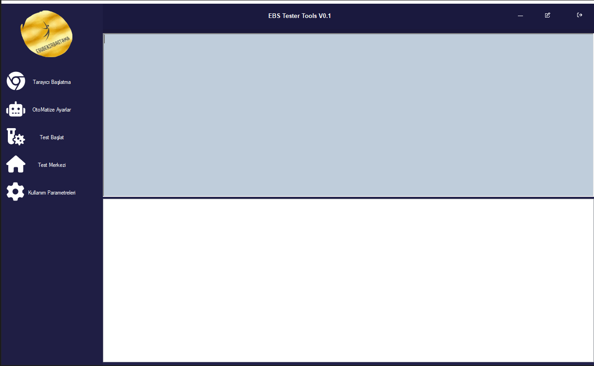
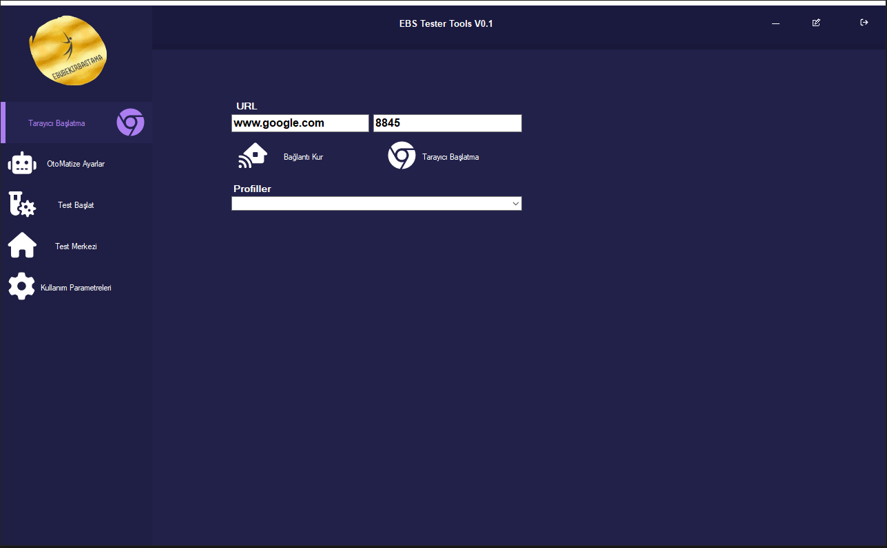
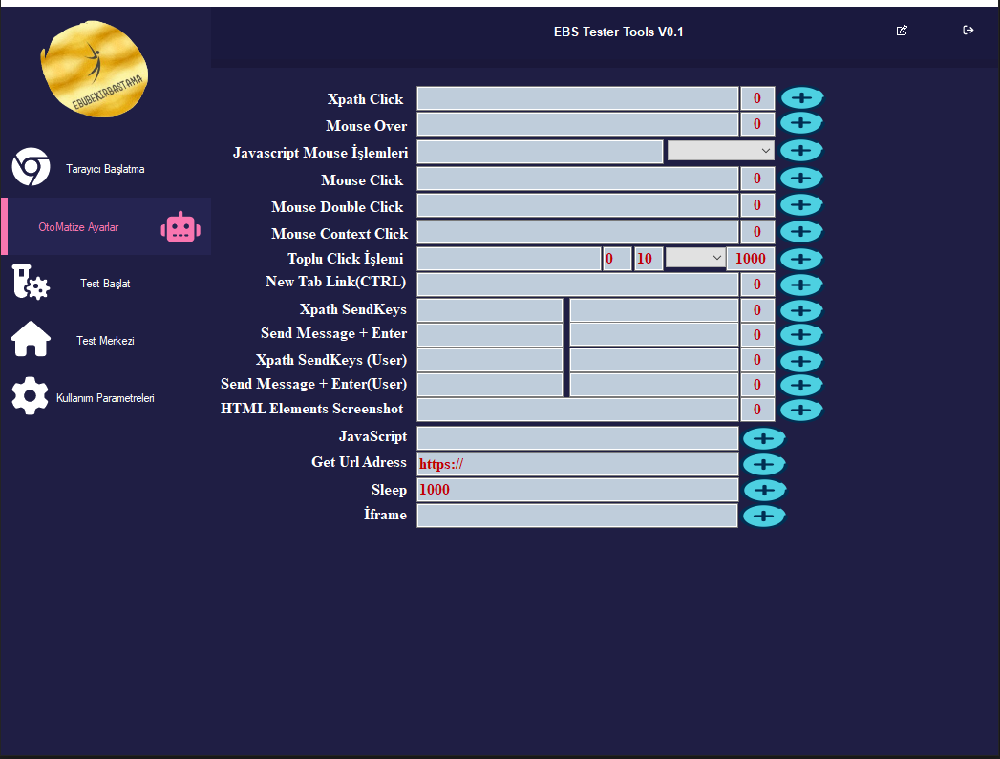
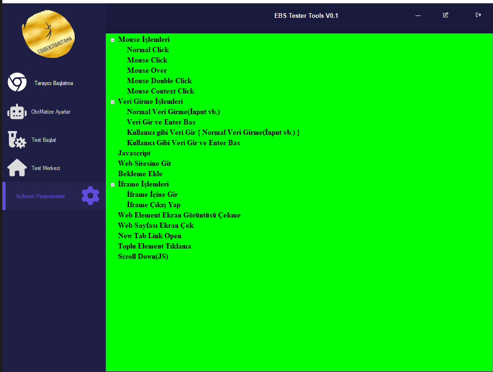

# EBS Tester Tools v0.1

Selenium Tabanlı Test Otomasyon Aracı

**Program Özellikleri:**
1. ** Özel Tarayıcı.
2. ** Selenium 4
3. ** UserAgent Değiştirme vd. Özellikleri .txt dosyasından çekme özelliği
4. ** Element ve class Otomatik Seçme Özelliği(Deneysel)
5. ** İframe ve birden fazla iframe içerisine girme ve elementlerde işlem yaptırma özelliği ve Girilen İframelerden çıkma Özelliği
6. ** Profil dosyaları bir merkezden yönetme özelliği(Her açılan profil dosyası programın çalıştığı yerde muhafaza edilmektedir.)
7. ** Manuel:Tıklama,MouseClick,KeysEnter,Javascript,Url Gitme,Bekletme Zamanı,İFrame Çıkış,Normal veri yazma gibi programın parametrelerini kullanabilme Özelliği
8. ** Normal Click İşlemi Yaptırabilme Özelliği.
9. ** Mouse Over İşlemi Yaptırabilme Özelliği.
10. ** Mose Click İşlemi Yaptırabilme Özelliği.
11. ** Normal input vb. elementlere veri yazma özelliği.
12. ** Google Aratma Gibi Yerlere veriyi yazıp Enter İşlemi Yaptırabilme Özelliği.
13. ** İşlemler Arası Bekletme Zamanı Ekleme Özelliği.
14. ** İFrame İşlemleri Yapabilme Özelliği(İframe içeriğine girip yukarıdaki bütün işlemleri yapabilirsiniz.)
15. ** Test Giriş ve Çıkış Zamanı ve ilerleyiş loglaması.
16. ** Logların .Txt Formatında Dışarı Aktarılması.
17. ** Kullanıcı gibi yazdırma özelliği.
18. ** Kullanıcı gibi yazdırma özelliği ve bitiminde enter'a basma
19. ** Web Sayfada Bulunan herhangi bir elementin ekran görüntüsünü çekme
20. ** Web Sayfasının Ekran Görüntüsünü Çekme Özelliği.
21. ** Linkleri Yeni Sekmede Açma Özelliği
22. ** Logların Html Olarak Dışarı Aktarılması.
23. ** Çift Tıklama (Double Click)
24. ** Yan Sekmede Link Açma Özelliği
25. ** Html Rapor Aktarma Özelliği
26. ** Aynı olan elementlerde Toplu Click Yapma İşlemi bu özellik ile aşağıdakiler yapılabilinir
  
a-) Mouse Click  
b-) Mouse Over  
c-) Mouse Double Click  
d-) Mouse New Tab  
e-) Normal Tıklama  

27. ** Shadow-Root İşlem Yapma(Javascript)
28. ** Sağ Tıklama (Context Click)
29. ** Fareyi Belirli Bir Yere Taşıma
30. **İframe Dışarı Çıkma
31. **Javascript Mouse Over
32. **Javascript Mouse DoubleClick
33. **Javascript Mouse MouseDown
34. **Javascript Mouse MouseUp
35. **Javascript Mouse MouseMove
36. **Javascript Mouse MouseOut
37. **Javascript Mouse MouseEnter
38. **Javascript Mouse MouseLeave
39. ** Javascript Mouse Click

**Gelecek Özellikler:**

1. Fare İmlecini Belirli Bir Yere Taşıma
2. Klavye Eylemleri (Tuş Basma, Bırakma, Kombinasyonlar){CTRL+C,V vd.}
3. Slider Kullanarak Bir Elemanı Kaydırma
4. Sürükle-Bırak(Drag-Drop) Özelliği Kullanımı.

---
Program Görselleri:

## Nasıl Kullanılır?

Detaylı kullanım bilgileri ve örnekler için [Kullanım Kılavuzu](docs/usage-guide.md) dosyasını inceleyebilirsiniz.

---

## Lisans

Bu proje [Apache 2.0 lisansı](LICENSE) altında lisanslanmıştır. Detaylı bilgiler için lisans dosyasını inceleyebilirsiniz.

---
